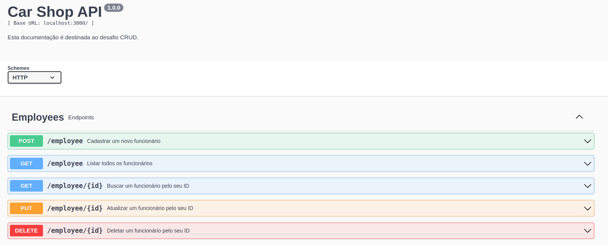
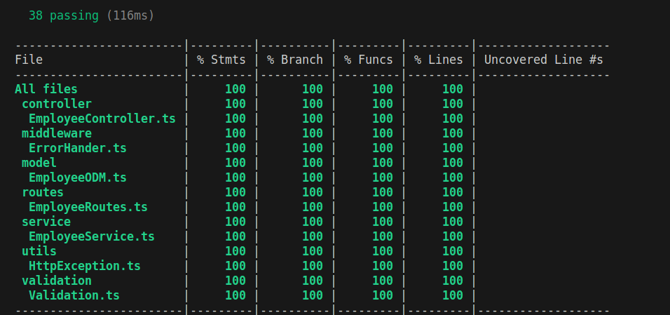

<h1 align="center">Boas-vindas ao repositório do Desafio CRUD!</h1>
<br />

## Objetivo

O <strong>Desafio CRUD</strong> é uma API de gerenciamento de funcionários, que permite a criação, leitura, atualização e exclusão. Foi utilizada princípios da programação orientada a objetos para a construção dessa API.

## O que foi desenvolvido?

O <strong>desafio CRUD</strong> é uma API que tem o objetivo de gerenciar o cadastro de funcionários no banco de dados. O docker foi utilizado para criar dois containers: um para o node.js, com a função de rodar o javascript do lado do servidor, e outro container para o banco de dados não relacional, que nesse caso é o mongoDB.

O typescript foi a linguagem escolhida para desenvolver essa aplicação, pelo motivo de possuir uma tipagem estática, garantindo mais confiabilidade no código. O express.js ficou com a responsabilidade de gerenciar as rotas, processar as requisições HTTP e definir os middlewares. A organização do projeto segue o modelo MSC (Model, Service e Controller), seguindo príncipios da programação orientada a objetos.

O ODM mongoose foi incluído para modelar e manipular o banco de dados, e os endpoints dessa API rest permitem fazer as principais operações (CRUD): criar, ler, atualizar e excluir. A aplicação conta com testes unitários, onde as camadas model, service e controller são testadas isoladamente. E com testes de integração para verificar o funcionamento integrado entre diferentes partes da API. A taxa de cobertura foi de 100% das camadas. As bibliotecas utilizadas foram mocha, chai e sinon.

## Linguagens e ferramentas
- Docker
- Node.js
- Typescript
- Express.js
- MongoDB
- Mongoose
- Mocha
- Chai
- Sinon

## Instalação e execução com docker

### 1 - Clone o repositório:

```
git clone git@github.com:h3zord/desafio-crud.git
```

### 2 - Entre no repositório:
```
cd desafio-crud
```

### 3 - Inicie os containers:
```
docker compose up -d
```

<strong>O container vai executar o node na porta 3000 e o banco de dados na porta 27017.</strong>
<br/>
➜ http://localhost:3000/

<br/>

<h2 align="center">Documentação</h2>

<div align="center">
  
</div>
<br/>

  ## <strong>A aplicação foi documentada com o swagger. Para verificar todos os endpoints acesse através do endereço ➜ http://localhost:3000/doc/</strong>
<br/>

## Endpoints

### - Employee
#### Método post:
- /employee ➜ Cadastra um novo funcionário.

#### Método get:
- /employee ➜ Lista todos os funcionários.
- /employee/:id ➜ Busca um funcionário pelo seu ID.

#### Método put:
- /employee/:id ➜ Atualiza um funcionário buscando pelo seu ID.

#### Método delete:
- /employee/:id ➜ Deleta um funcionário buscando pelo seu ID.

<br/>

## Execução dos testes

### 1 - Entre no container do node:
```
docker exec -it desafio_crud sh
```
### 2 - Rode o script:
```
npm run test:coverage
```

<h2 align="center">Cobertura de testes</h2>
<br />

<div align="center">
  
</div>
<br />
